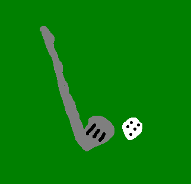

Golf
====

History
-------

**100 BC** is the first recorded instance of humans playing the game of golf. The first game of golf was played with a bent stick and a ball made of leather. Since golf was gaining popularity quickly among humans, it was decided that golf would officially become a sport in the 15th century. That did not last for long though because in 1457, the Scottish Parliament banned the sport of golf, stating that it interfered with the practice of archery, which was used as a national defense at the time. The ban on golf was officially lifted in 1500, and ever since then, the sport has been gaining popularity. In 1744, the first rules of golf were constructed by the *Honourable Company of Edinburgh Golfers*.

`Source <https://www.igfgolf.org/about-golf/history/>`_

How to Golf
-----------

To golf, you will need to purchase golf clubs. In a set of golf clubs, you will find your driver, irons, wedges, and putter. You will typically use your driver when hitting from great distances. Next you will use your irons, depending on how far away you are from the green. The irons are numbered from five to nine, five hitting with the most distance, and nine hitting with the least amount of distance. Depending if you are on the green or not, you will hit with your pitching wedge next. Once you are on the green, you may begin using your putter to hit the ball into the hole.

The most important thing to have while learning how to golf is patience. Golf is not an easy spot to learn, and it takes time before you will begin to see real progress.

Today
-----

+-------------------+--------------------------+-----------------+
|Golfer             | 9-Hole Score             | 18-Hole Score   |
+===================+==========================+=================+
|   Abby Tefft      | 46                       | 79              |
+-------------------+--------------------------+-----------------+
| Tierney Dalsing   | 55                       | 83              |
+-------------------+--------------------------+-----------------+
| Zach Stevenson    | 48                       | 80              |
+-------------------+--------------------------+-----------------+
| Pete Schoen       | 39                       | 70              |
+-------------------+--------------------------+-----------------+