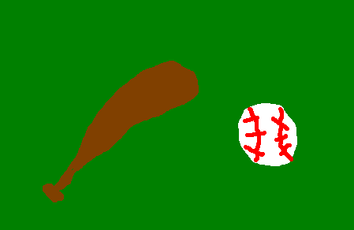

Softball
========

History
-------
Many believe that softball originated because of baseball, but the first softball was created because of a football game. The first softball game was initiated by two football fans using a boxing glove as a ball, and a broom handle as a bat. The game initially started in Chicago, and quickly spread around the Midwest. In 1926, the term “softball” was first used by a man named **Walter Hakanson** while representing the *YMCA* at a *National Recreation Congress* meeting, and by 1930, the sport was officially named softball. The game originally began as an indoor game for baseball players to maintain their skills while off season, but it gained so much popularity that they decided to make softball its own sport. Softball was added to the 1996 Summer Olympics, but eventually dropped in 2012.

`Source <http://www.athleticscholarships.net/history-of-softball.htm>`_

How to Play Softball
--------------------

In softball, there are nine players on the field at a time. Some softball positions include pitcher, catcher, first baseman, second baseman, shortstop, third baseman, and outfielder. At the end of the game, the team that has scored the most runs, which is done by hitting the ball and running around the bases, wins.

Softball is played much like how baseball is played, but the difference between baseball and softball is with the size of the ball. A softball is a much larger ball than a baseball. 

Today
-----
+-----------------+--------------------------+-------------+
|Player           | Team                     | BA          |
+=================+==========================+=============+
| Whitney Lynch   | The Swamp Scorers        | .505        |
+-----------------+--------------------------+-------------+
| Steph Haupert   | Dramatic Dribblers       | .497        |
+-----------------+--------------------------+-------------+
|  Olivia Kuhn    | Inland Ballz Streakers   | .486        |
+-----------------+--------------------------+-------------+
| Crystal Hecker  | Gonzo Chillers           | .483        |
+-----------------+--------------------------+-------------+