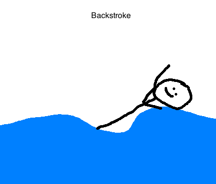
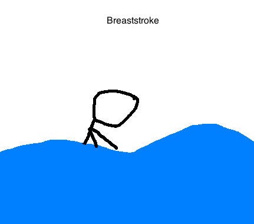
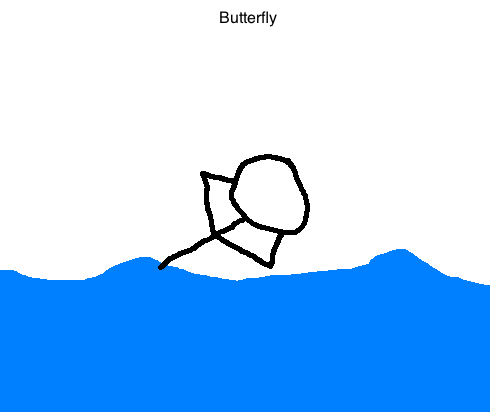
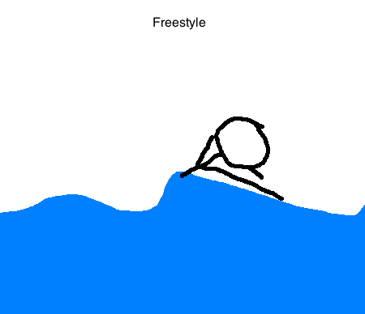

Swimming
========

History
-------

Swimming has been prevalent since the Stone Age, but did not officially become an organized sport until the 19th century. In earlier times, swimming was usually taught to cross rivers and lakes. It was often referenced in Greek mythology, and found in many cave paintings by Egyptians. The National Swimming Society of Great Britain was eventually formed in the 19th century, thus leading to the recognition of swimming as a competitive competition.

Swimming did not become an Olympic sport until 1896. When it was first introduced, the only strokes that were used were the freestyle and the breaststroke. Now, Olympic swimmers use the backstroke, freestyle, breaststroke, and butterfly to compete with athletes around the world.

`Source <https://www.olympic.org/swimming-equipment-and-history>`_

How to Swim
-----------

Swimming lessons are always being taught year-round for those who are interested in learning how to swim. They often have lessons being taught at your local *YMCA* and pool. If you would like to learn how to swim competitively, joining a swimming club is a great idea! Many cities will have different teams that anyone can join, depending on your age. 

Below is an example of what each stroke for competitive swimming should look like:

Today
-----

+-----------------+--------------------------+-------------+
|Swimmer          | Race                     | Best Time   |
+=================+==========================+=============+
|   Sarah Salas   | 50 m. Freestyle          | 22.54       |
+-----------------+--------------------------+-------------+
|   Grant Davis   | 200 m. Individual Medley | 2:18.01     |
+-----------------+--------------------------+-------------+
|   Karla Schoen  | 500 m. Freestyle         | 4:42.13     |
+-----------------+--------------------------+-------------+
| Lauren Caldwell | 100 m. Fly               | 1:00.83     |
+-----------------+--------------------------+-------------+